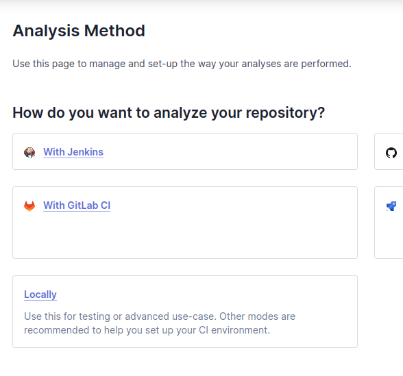

# Bash-scripted CI-CD Emulator

## Pre-requisites

In order to execute correctly this emulator you must have prevously installed these tools:

* Linux distro

* Docker engine and docker-compose:
  https://docs.docker.com/compose/install/
* Terraform - I encourage to use tfenv project for managing different terraform versions:
  https://github.com/tfutils/tfenv#tfenv-install-version

## SonarQube service configuration requirement
The pipeline requires that a SonarQube service is up and running beforehand in order to carry out the security test step in the pipeline.
This repository provides a docker-compose config file for this purpose:
```bash
# Go into the folder
$ cd sonarqube

# Have the Sonarqube service up and running
$ docker-compose -f compose.yml up -d
```
Please take a look at the compose file to detail what this service is using.

Afterwards, you may have the UI for this service at (http://localhost:9000).When the SonarQube portal homepage appears, go ahead and log in; use the default username and password (“admin”). Next, you’ll be asked to update your password. Afterwards you can setup a project:


For this particular case select as in the next image and hit the create project button:


Now you are asked to choose the analysis method and "Locally" is the chosen option:



Then the token screen is presented where you either provide a token or generate a new one(selected in this case):


Then push down the continue button:


And finally as soon as you choose 'Other(Python)' and 'Linux' as OS, you get the values for the environment variables required on the 'How to Use' section:


Please open the set_env.sh file these values with the above obtained data.

## How To Use

To clone and run this application, you'll need [Git](https://git-scm.com) and the above listed pre-requisites installed on your computer. From your command line:

```bash
# Clone this repository
$ git clone https://github.com/amitmerchant1990/electron-markdownify

# Go into the folder
$ cd cicd

# Set the pipeline.sh and set_env.sh files to executable
$ chmod +x pipeline.sh set_env.sh

# Run the script that inits required SonarQube parameters 
$ ./set_env.sh

# Set the required enviroment variables
$ ./pipeline.sh $SONARQUBE_URL $YOUR_PROJECT_KEY $SONAR_AUTH_TOKEN
```

Now on your terminal the ci/cd pipeline application should look like this:


The promt awaits for you to type the number of the step you want run.

> **Notes:**
> Steps 1 and 3 are not yet available.
> Ideally the pipeline should run without human intervention, but in this case this is a controlled emulation.


